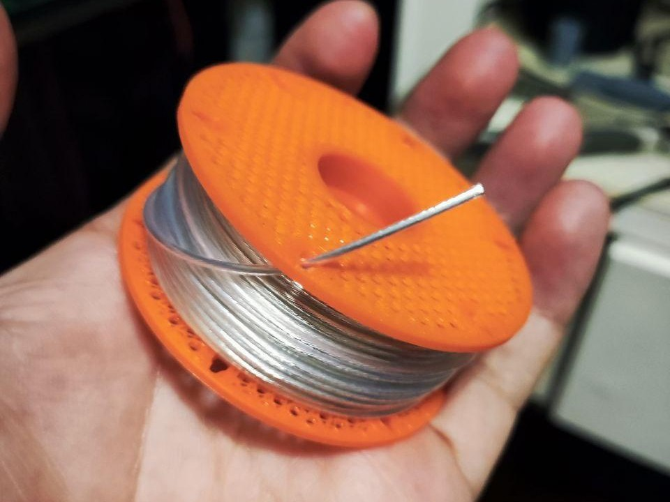
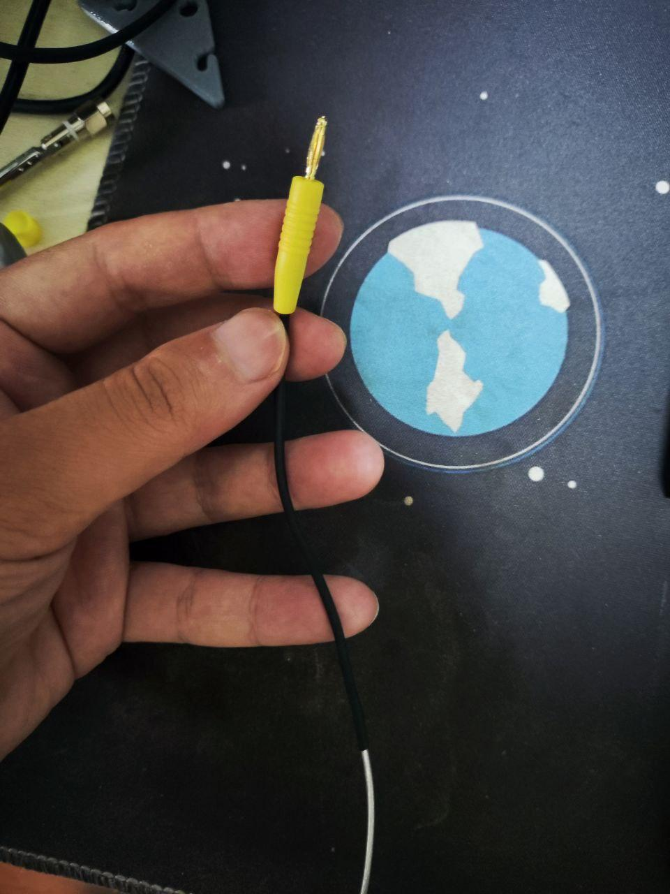

此文档为BTE的QRP端馈套件组装教程

## 套件物料清单 BOM

| 名称 | 数量 |
|-----|-----|
| 绕线板一体底座(3D打印) | 1个 |
| 顶盖(3D打印) | 1个 |
| 线圈骨架(3D打印) | 1个 |
| 绝缘子(3D打印) | 1个 |
| 倒V挂钩(3D打印) | 1个 |
| 2643625001 磁环 | 1个 |
| 0.5平方特氟龙镀银线 | 1卷（约21米） |
| 0.6mm 漆包线  | 1米 |
| 吸锡带 | 2cm |
| BNC母座 | 1个 |
| 100pF电容 | 1个 |
| 尼龙扎带 | 2条 |
| 魔术贴扎带 | 1条 |
| 2mm 黑色香蕉插母座 | 1个 |
| 2mm 黄色香蕉插母座 | 1个 |
| 2mm 黄色香蕉插头 | 1个 |
| 2mm 黑色香蕉插头 | 1个 |
| 10cm 热缩管 | 1个 |
| 4cm 热缩管 | 1个 |
| 2cm 热缩管 | 1个 |

## 开始组装

### 1.绕制振子补偿线圈

取出镀银线：

取出线头，测量约**283cm**的长度，并使用胶布做一个记号：

拿出线圈骨架，将线头从**最下方**的孔**从外向内**穿入，直到胶带记号处：

将线头从**下方第二个**孔**从内向外**穿出，并拉紧：

将线头顺着骨架上的凹槽缠绕（共10圈），并将线头从**上方第二个**孔**从外向内**穿入拉紧，注意线不要线交叉、重叠：

利用食指转动，确保将线拉紧:

将线头从最后一个孔**从内向外**穿出并拉紧，完成后如图：

### 2.焊接黄色香蕉插

取出 10cm 热缩管，香蕉插针、黄色护套：

依次将黄色护套、10cm 热缩管穿入镀银线：

剥除线头绝缘外皮，并用焊锡将线头与香蕉插针焊接到一起：

将热缩管滑动到香蕉插根部，加热热缩管使其收缩：

将黄色护套向上滑动，并将香蕉插头装入：

### 3.安装香蕉插座

取出黄色香蕉插座，将香蕉插头插入插座中（作为辅助散热），使用烙铁和锡丝对焊片进行上锡:

如法炮制，对黑色香蕉插座上锡：

将香蕉插座安装到3D打印的底座中，**注意上锡的面朝上**：

### 4.安装BNC插座

取出BNC母座，和 2cm长的吸锡带:

将吸锡带的一端用焊锡与BNC母座的焊片焊接到一起:

将BNC母座焊片弯折90度：

将bnc母座安装进3D打印的底座中，**焊片朝下, 吸锡带从后方绕到黑色香蕉插座的焊片上**：

将香蕉插插入黑色香蕉插座（作为辅助散热），使用焊锡，将吸锡带与黑色香蕉插座焊接到一起(**注意烙铁不要碰到3D打印底座**):

使用12mm扳手拧紧bnc座的螺母:

使用一字起拧紧香蕉插座的螺母：

### 5.绕制 49：1 un-un

取出磁环和0.6mm漆包线，线头预留约3cm，进行绕制：

为了绕线更紧密，建议在每次要穿过磁环前，**先做一个折痕**，再做穿线的动作：

在绕至第3圈(线每穿过磁环中心算作1圈)的时候做一个抽头，抽头长度与线头保持一致:

继续绕制18圈，也就是完成之后一共是21圈：

使用工具，拉紧抽头：

剪开抽头，对漆包线进行刮漆, 并将刮好漆的抽头拧在一起：

将刮开的线头上锡:

### 6.安装 49：1 un-un

将做好的 un-un 放进底座进行预组，修剪掉过长的漆包线：

将 un-un 如图所示，与香蕉插座和BNC座进行焊接(**注意抽头是与BNC的中心导体连接, 焊接时插入香蕉插进行辅助散热**):

取出100pF电容：

将电容引脚修剪到合适长度，如图所示进行焊接(**焊接时插入香蕉插进行辅助散热**):

### 7.安装顶盖

将盖子一边卡入凹槽，另一边用一字起辅助，将顶盖按入即可：

### 8.安装振子

将黄色香蕉头从右上角的孔交错穿入：

使用尼龙扎带进行固定：

将振子按照“8”字形绕在绕线板上：

绕至末端线头时，取出绝缘子：

从线头末端一次套入 2cm热缩管、 4cm热缩管：

将热缩管滑动到1m的位置，加热4cm热缩管使其收缩, 并将线头穿过绝缘子, 调整到4cm热缩管的位置:

将线头与自身缠绕，向上滑动2cm热缩管，包裹住线头，加热热缩管使其收缩：

### 9.安装魔术贴扎带

将魔术贴扎带穿过绕线板上的开口，并使用热熔胶或者其他方式固定：

## 成品展示

## 调谐

**根据实际情况，移动绝缘子的位置，改变振子回折长度即可（不建议修剪）**

更多介绍请点[这里](/hamradio/2025/05/introduction/)
