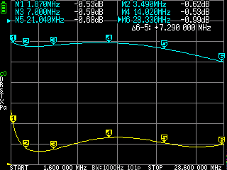
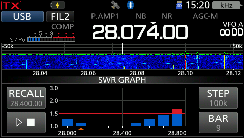

最近迷上了短波QRP，所以搞了个QRP便携端馈。

## 磁环选择

比如市售成品端馈天线很多都没有给出关于磁环un-un效率的数据。偶然间看到苏格兰火腿 MM0OPX 对不同磁环以及绕制方式的视频以及测试[数据](https://docs.google.com/spreadsheets/d/1OCBE5aVc_kkPXRaPDy-xGL7LLEAjUilN/edit?gid=747802978#gid=747802978)。其中两款磁环脱颖而出，他们在整个HF业余段都有接近90%甚至更好的效率，分别是: 2643625002 和 2643251002。 其中 2643625002 被标注为 QRP, 因为它体积小、重量也轻。于是选择它开始制作QRP便携端馈。

## 磁环效率

测试磁环效率的方法其实很简单，绕两个一模一样的49：1 un-un, 然后把他们按照“背靠背”的方式连接在一起，连接nanoVNA测试s21 logmag, 得到两个磁环的损耗，再将结果除以2, 得到单个磁环的效率。

即使MM0OPX已经给出了他的测试数据，采用 21/3(auto transformer)的绕制方式能获得最高效率，但还是需要眼见为实，并且确保我们买到的磁环是正品，买到的磁环最好还是再测试一下。

- 接线方式：

  

- S21 Logmag数据:

  

- 计算效率：

| Band | 磁环损耗x2 (dB) | 磁环损耗x1 (dB) | 效率 (%) |
|------|----------------|---------------|----------|
| 160m | -0.53 | -0.265 | 94.08 |
| 80m | -0.62 | -0.31 | 93.11 |
| 40m | -0.59 | -0.295 | 93.43 |
| 20m | -0.53 | -0.265 | 94.08 |
| 15m | -0.68 | -0.34 | 92.47 |
| 10m | -0.99 | -0.495 | 89.23 |

__结论：在实验误差允许的范围内，磁环是没问题的__

## 馈线选择

QRP首选还是轻便，目前选用的是 rg316。 rg316有两个优势，一个是比rg58更轻，一个是可弯折半径更小（可反复弯折半径约40mm）。
5m长的rg316重量大概是100g（算上两个BNC头), 损耗大约是 -0.6dB @28Mhz、-0.4dB @14Mhz，在HF范围内完全可以接受。这样天线+馈线的整体重量不超过350g，分布在振子和绳子上的拉力很小，可以非常轻松地将馈电点拉高，以获得更高的增益和更低的仰角。

## 40米驻波2.0问题

根据以上磁环效率测试，先采用 21/3 绕法制作了一个un-un, 然后接上20米振子进行调谐。 理论上应该要谐振7Mhz才对，但无论怎么调整振子长度，天线架设方式，7Mhz可以达到的最低SWR就是 2.0 了。这个问题困扰了我很久，最终以一种神奇的方式解决了（后面会提到）。

## 20米端馈4个波段？

理想情况下，2450ohm阻抗在最低可用频率的整数倍频率上重复出现，也就是说一个谐振7Mhz的天线，也会谐振14Mhz、21Mhz、28Mhz。
实际上做出来之后会发现，一条仅由20米长导线做成的端馈，谐振点大概在 7Mhz、14.2Mhz、21.5Mhz、29Mhz。高波段（15米/10米）的谐振频率常常会偏高，落在不常用、甚至业余段以外的频段上。

### 解决办法一

用天调！一般的机内天调都至少能调3：1，所以天调拉一拉就能用。但比较惨是一些QRP设备没有内置天调：比如IC-705、QMX等，外出野架QRP肯定也不想再带一个天调。
 
### 解决办法二

在离馈电点2米左右的地方，在振子上加一个补偿线圈，这个电感可以拉低高波段的谐振频率，使高波段谐振点回到常用频率范围，但又不会对低波段造成太多影响。

__为了尽量少带东西，果断选择方法二__

_当我加上补偿线圈之后，不仅改善了高波段谐振点，同时也解决了40米波段2.0驻波的问题_

## SWR 测试

以下测试结果使用IC-705进行，天线采用斜拉架设方式（馈电点离地约3米、振子末端离地约10米), 馈线靠近电台一侧采用TDK卡扣磁环绕5圈，形成共模扼流环。

## 野架如何把端馈拉到空中？

两种办法：一种是利用伸缩杆（抄网杆）、另一种是找树。 前者需要多带一根伸缩杆还有若干风绳、营钉之类的东西，后者只需要带绳子和攀树豆袋，所以目前我比较倾向于后者，但后者需要一定的练习。关于攀树豆袋（throw bag）和抛绳（throw line）的使用，网上能找到很多教程、都比我专业，这里就不赘述了。

## 倒V方式架设

水平方向空间有限的情况下还可以考虑倒V方式架设，先将绳子抛过树枝，将绳子与天线振子中点处进行连接：

