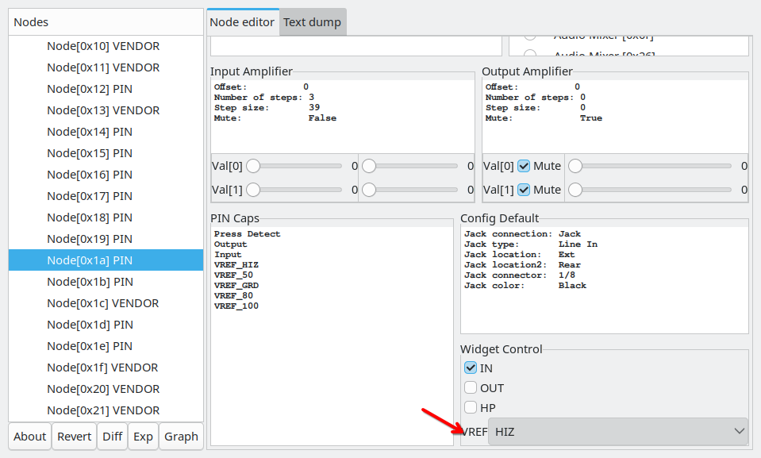

## 传送门

**前面一大段在讲解决声卡问题的经历，如果你只关心如何向内核提交代码，请点击[传送门](#拉取代码)**


## 起因

本人办公使用公司的某联想商务台式，前面板只有一个耳麦接口(TRRS)，发现只有耳机正常工作，麦克风没声。
一般来说这种可以通过给模块 `snd_hda_intel` 加参数 `model=your_model_setting` 来使用针对于某一机型的特定修复方案来解决，ArchWiki 上更是直接说 `dell-headset-multi` 是最常见的一个 model， 即使你的电脑不是 Dell 也可以试试。
但本人的声卡比较特殊，是 ALC897，[而 `dell-headset-multi` 这个 module 是针对 `ALC269` 或其马甲版本](https://github.com/torvalds/linux/blob/4fe89d07dcc2804c8b562f6c7896a45643d34b2f/sound/pci/hda/patch_realtek.c#L9697)。

既然看过了 `patch_realteck.c` 的源码，那我们就来看看 ALC897 目前都有哪些 fix: 

在 11025 行，找到了三个枚举:

```c
	ALC897_FIXUP_LENOVO_HEADSET_MIC,
	ALC897_FIXUP_HEADSET_MIC_PIN,
	ALC897_FIXUP_HP_HSMIC_VERB,
```

搜索 `ALC897_FIXUP_LENOVO_HEADSET_MIC`：

```c
	[ALC897_FIXUP_HEADSET_MIC_PIN] = {
		.type = HDA_FIXUP_PINS,
		.v.pins = (const struct hda_pintbl[]) {
			{ 0x1a, 0x03a11050 },
			{ }
		},
		.chained = true,
		.chain_id = ALC897_FIXUP_LENOVO_HEADSET_MIC
	},
```

发现他其实是在 `ALC897_FIXUP_HEADSET_MIC_PIN` 之后被连锁执行

搜索 `ALC897_FIXUP_HEADSET_MIC_PIN` 之后跳到了 11501 行：

```c
SND_PCI_QUIRK(0x17aa, 0x1057, "Lenovo P360", ALC897_FIXUP_HEADSET_MIC_PIN),
```

于是打算试一试这个model

``` bash
systemctl --user stop pipewire.socket
sudo modprobe -r snd_hda_intel
sudo modprobe snd_hda_intel model=17aa:1057
```

结果是依旧不行，虽然都是联想，国内机型和国际机型还是有差别的，所以现在只能靠自己了。

找到 [More Notes on HD-Audio Driver](https://www.kernel.org/doc/html/latest/sound/hd-audio/notes.html) 
这篇文档

>A part of the problem is broken BIOS, and the rest is the driver implementation.

这篇文档给出了 Debug 的方向和可以使用的工具

## 排错

具体要排查的东西应该按上述文档一项一项地进行，我这里就说一下我排查到发现的问题。

### Pin-Configuration

这是 HD-Audio 用来配置每个线路（Pin）上的：设备（扬声器、麦克风、Line Out等）、插孔类型（3.5mm、6.5mm等）、插孔位置(前面板、后面板)、是否有插孔检测（用来检测设备是否插入）、插孔颜色等在七杂八的东西的。

首先你的设备能不能被识别出来就取决于 Pin-Configuration

我们从 `/sys/class/sound/hwC0D0/init_pin_configs` 可以读到BIOS给出来的 pin-configuration

```plain
0x11 0x40000000
0x12 0x411111f0
0x14 0x01011010
0x15 0x411111f0
0x16 0x411111f0
0x17 0x411111f0
0x18 0x411111f0
0x19 0x411111f0
0x1a 0x41111190
0x1b 0x02211020
0x1c 0x411111f0
0x1d 0x40200001
0x1e 0x411111f0
0x1f 0x411111f0
```

这里简单说一下这个格式，第一列是 pin 的 id, 第二列是 config 的值
根据 [HD-Audio 标准定义文档（ps: 这个规范标准是 Intel 出的）](https://www.intel.com/content/dam/www/public/us/en/documents/product-specifications/high-definition-audio-specification.pdf)

这个 Config 值按位划分了控制的功能：

| 31:30 | 29:24 | 23:20 | 19:16 | 15:12 | 11:8 | 7:4 | 3:0 |
| --- | --- | --- | --- | --- | --- | --- | --- |
| Port Connectivity | Location | Default Device | Connection Type | Color | Misc | Default Association | Sequence|

详细的定义感兴趣的话从 [179页](https://www.intel.com/content/dam/www/public/us/en/documents/product-specifications/high-definition-audio-specification.pdf#page=179) 开始看吧

这里我们就说一下我们的关注点：

31:30位上值为 `01b` 的, 也就是 `0x4`、`0x5`、`0x6`, `0x7` 这些开头的配置表示该 pin 上是没有任何设备连接的，也就是没有用的pin

过滤掉这些的 cofig 就剩下:

```plain
0x14 0x01011010 （Line-Out 带插孔检测）
0x1b 0x02211020  (Headphone-Out 带插孔检测)
```

好家伙！也就是 BIOS 给的 pin-config 里面根本没有麦克风，难怪会找不到。

接下来就是尝试在“没用的pin”当中找到麦克风实际使用的pin, 并把它的pin-config设置为麦克风。
**需要注意的是：这个麦克风可能有插孔检测、或者它没有插孔检测，需要共用耳机的插孔检测，因此先不管它有没有插孔检测，我们先设为没有插孔检测，也就是 `0x01a11140`**

具体操作就是：

```bash
echo <LAST_PIN_ID> 0x411111f0 | sudo tee /sys/class/sound/hwC0D0/user_pin_configs
echo <CURRENT_PIN_ID> 0x01a11140 | sudo tee /sys/class/sound/hwC0D0/user_pin_configs
echo 1 | sudo tee /sys/class/sound/hwC0D0/reconfig
```
**LAST_PIN_ID 为上一次尝试的 Pin, CURRENT_PIN_ID为当前尝试的 Pin**

对没有使用到的Pin重复以上步骤把它改为“麦克风（无接口检测）”测试麦克风是否有反应。

**提示：麦克风无法收音不代表当前 Pin 就是错的，厂商往往就在这里使坏！！！**

### Pin Widget & Pin Control

根据 [HD-Audio 标准文档](https://www.intel.com/content/dam/www/public/us/en/documents/product-specifications/high-definition-audio-specification.pdf#page=136) 第136页关于 Pin Widget 的说明当中有提到：

>Pin Widget‟s capabilities are highly parameterized defining optional support for:
>
>Input, output (or both), including the presence and capability of amplifier(s)
>
>Stereo or mono (1- or 2-channel), or more than 2 channels
>
>Plug (presence) detection
>
>Attached device impedance sensing
>
>VRef bias for microphone support

其中就有一个 `VRef bias for microphone support` 引起注意，大致说的是麦克风参考电位，我们再回去看一下 [patch_realteck.c](https://github.com/torvalds/linux/blob/v6.0/sound/pci/hda/patch_realtek.c) 搜索关键字 `vref`, 发现有一大堆设备的 vref 不在 mic 本身的 pin 上，而是使用耳机或者扬声器的pin作为麦克风的参考电位。 **当时我根本不知道还有这种骚操作，于是把pin挨着试完了都没发现麦克风有反应，在这里卡了很久**

关于 Pin-Control 我们在不改代码的时候如何调试， 可以使用 hda-verb 命令，但是对于新手你并不知道对应的那些HDA VERB值应该取多少，所以借助这个图形工具 `https://github.com/gm-vm/hda-analyzer`

现在确认麦克风所在的 Pin 的步骤就变成了：

1. 设置一个 pin 为麦克风（无插孔检测）
2. 打开 hda-analyzer
3. 找到麦克风的 pin，找到Widget Control一栏，检查 VREF 是否设置在 HIZ（高阻态），如果是，将其改为 50、80、100、GRD，观察录音软件是否有输入信号
4. 如果麦克风的 pin 的 VREF 已经默认在50、80、100任意一个上，但录音软件没有一点输入信号，大概率就是麦克风使用了扬声器或者耳机的 pin 上的 Vref 作为麦克风参考电位。我的设备就是这种情况，找到 0x1b（耳机所在pin） 发现 0x1b 的 VREF 默认果然是在 HIZ （高阻态）上，将其改为 50、80、100，如果麦克风 pin 设置正确了，此时录音软件上应该会看到有输入信号跳变。
5. 若已经有输入信号了，观察音频波形图正负值是否均匀，若不均匀则调整 VREF 的大小，若还是没有输入信号，则换一个 pin，回到第1步。



### 确认麦克风是否有自己的接口检测

经过确认，我的麦克风 pin 为 `0x1a`, 但是还没确认上面是否有插孔检测

将 `0x01a11140` 第 11:8 位的 01b 改为 00b， 变成 `0x01a11040` 表示插孔检测检测

```bash
echo 0x1a | sudo tee /sys/class/sound/hwC0D0/user_pin_configs
echo 1 | sudo tee /sys/class/sound/hwC0D0/reconfig
```

此时我们插入耳机，执行 `sudo hdajacksensetest`， 得到输出：

```plain
Pin 0x14 (Black Line Out, Rear side): present = No
Pin 0x1a (Black Mic, Front side): present = No
Pin 0x1b (Black Headphone, Front side): present = Yes
```
说明 0x1a 上没有接口检测

## 方案

经过上述的努力之后，找出了修复步骤：

1. 设置 Pin-Config： `0x1a 0x01a11140`
2. 设置 0x1b 的 Pin-Widget 为: HP(耳机) + AC_PINCTL_VREF_100（参考电位: 100mV (单位是否是 mV 我不确定，如果你在hda标准定义里面找到请告诉我)）

## 代码

> Talk is cheap, show me the code.

### 拉取代码

因为我们修复的是 alsa, 我们最好是拉取 sound 分支仓库，以最大程度地避免补丁合并冲突

```bash
git clone https://git.kernel.org/pub/scm/linux/kernel/git/tiwai/sound.git
```

### 修改 `patch_realtek.c`

代码不多，直接贴出来：

```patch
--- a/sound/pci/hda/patch_realtek.c
+++ b/sound/pci/hda/patch_realtek.c
@@ -10999,6 +10999,17 @@ static void alc897_fixup_lenovo_headset_mic(struct hda_codec *codec,
 	}
 }
 
+static void alc897_fixup_lenovo_headset_mode(struct hda_codec *codec,
+				     const struct hda_fixup *fix, int action)
+{
+	struct alc_spec *spec = codec->spec;
+
+	if (action == HDA_FIXUP_ACT_PRE_PROBE) {
+		spec->parse_flags |= HDA_PINCFG_HEADSET_MIC;
+		spec->gen.hp_automute_hook = alc897_hp_automute_hook;
+	}
+}
+
 static const struct coef_fw alc668_coefs[] = {
 	WRITE_COEF(0x01, 0xbebe), WRITE_COEF(0x02, 0xaaaa), WRITE_COEF(0x03,    0x0),
 	WRITE_COEF(0x04, 0x0180), WRITE_COEF(0x06,    0x0), WRITE_COEF(0x07, 0x0f80),
@@ -11082,6 +11093,8 @@ enum {
 	ALC897_FIXUP_LENOVO_HEADSET_MIC,
 	ALC897_FIXUP_HEADSET_MIC_PIN,
 	ALC897_FIXUP_HP_HSMIC_VERB,
+	ALC897_FIXUP_LENOVO_HEADSET_MODE,
+	ALC897_FIXUP_HEADSET_MIC_PIN2,
 };
 
 static const struct hda_fixup alc662_fixups[] = {
@@ -11508,6 +11521,19 @@ static const struct hda_fixup alc662_fixups[] = {
 			{ }
 		},
 	},
+	[ALC897_FIXUP_LENOVO_HEADSET_MODE] = {
+		.type = HDA_FIXUP_FUNC,
+		.v.func = alc897_fixup_lenovo_headset_mode,
+	},
+	[ALC897_FIXUP_HEADSET_MIC_PIN2] = {
+		.type = HDA_FIXUP_PINS,
+		.v.pins = (const struct hda_pintbl[]) {
+			{ 0x1a, 0x01a11140 }, /* use as headset mic, without its own jack detect */
+			{ }
+		},
+		.chained = true,
+		.chain_id = ALC897_FIXUP_LENOVO_HEADSET_MODE
+	},
 };
 
 static const struct snd_pci_quirk alc662_fixup_tbl[] = {
@@ -11560,6 +11586,7 @@ static const struct snd_pci_quirk alc662_fixup_tbl[] = {
 	SND_PCI_QUIRK(0x17aa, 0x32cb, "Lenovo ThinkCentre M70", ALC897_FIXUP_HEADSET_MIC_PIN),
 	SND_PCI_QUIRK(0x17aa, 0x32cf, "Lenovo ThinkCentre M950", ALC897_FIXUP_HEADSET_MIC_PIN),
 	SND_PCI_QUIRK(0x17aa, 0x32f7, "Lenovo ThinkCentre M90", ALC897_FIXUP_HEADSET_MIC_PIN),
+	SND_PCI_QUIRK(0x17aa, 0x3742, "Lenovo TianYi510Pro-14IOB", ALC897_FIXUP_HEADSET_MIC_PIN2),
 	SND_PCI_QUIRK(0x17aa, 0x38af, "Lenovo Ideapad Y550P", ALC662_FIXUP_IDEAPAD),
 	SND_PCI_QUIRK(0x17aa, 0x3a0d, "Lenovo Ideapad Y550", ALC662_FIXUP_IDEAPAD),
 	SND_PCI_QUIRK(0x1849, 0x5892, "ASRock B150M", ALC892_FIXUP_ASROCK_MOBO),
```

**几个说明：**
	
`spec->parse_flags |= HDA_PINCFG_HEADSET_MIC;` 加这个可以让麦克风识别成 “Headset Mic”， 没有别的作用。

关于设置 0x1b 的 pin-control 的操作是放到 "Auto-Mute Hook" 里面去做的（插孔检测到变化的时候会触发该 Hook），即 `spec->gen.hp_automute_hook = alc897_hp_automute_hook;`。
`alc897_hp_automute_hook` 这个函数是之前就有的，直接用就行了，具体内容贴一下(对照一下前面说的设置 0x1b 的 Pin-Control 可以看一下)：

```c
static void alc897_hp_automute_hook(struct hda_codec *codec,
					 struct hda_jack_callback *jack)
{
	struct alc_spec *spec = codec->spec;
	int vref;

	snd_hda_gen_hp_automute(codec, jack);
	vref = spec->gen.hp_jack_present ? (PIN_HP | AC_PINCTL_VREF_100) : PIN_HP;
	snd_hda_codec_write(codec, 0x1b, 0, AC_VERB_SET_PIN_WIDGET_CONTROL,
			    vref);
}

```

### 提交代码

```bash
git add sound/pci/hda/patch_realtek.c
git commit
```

Commit message 内容:

```plain
ALSA: hda/realtek: Add quirk for Lenovo TianYi510Pro-14IOB

Lenovo TianYi510Pro-14IOB (17aa:3742)
require quirk for enabling headset-mic

Signed-off-by: Edward Pacman <edward@edward-p.xyz>
Link: https://bugzilla.kernel.org/show_bug.cgi?id=216756
```

`Signed-off-by:`  提交者是谁

`Link:` 跟这个patch有关的外部链接

### 生成补丁文件

```bash
git format-patch HEAD^
```

检查一下生成的补丁文件内容：

``` bash
cat 0001-ALSA-hda-realtek-Add-quirk-for-Lenovo-TianYi510Pro-1.patch
```
**主要检查：`From:` 这一栏，内核要求提交使用 Full Name**

- 正确示例： `From: Edward Pacman <edward@edward-p.xyz>`
- 错误示例： `From: edward-p <edward@edward-p.xyz>`

如果有问题请修改 gitconfig 的 user.name 一栏，然后重新提交代码

### 发送邮件

配置 git 的 smtp 配置 （发件的邮箱应与补丁的 `From` 使用的邮件地址一致，否则会被视为你是帮别人发送补丁，就有一个是否征求过补丁作者同意的问题）

```plain
[sendemail]
  smtpuser = edward@edward-p.xyz
  smtpdomain = edward-p.xyz
  smtpserver = mail.edward-p.xyz
  smtp-auth = plain
  smtpencryption = tls
  smtpserverport = 587
```

弄好之后就可以使用 `git send-email` 来发送邮件：

```bash
git send-email \
0001-ALSA-hda-realtek-Add-quirk-for-Lenovo-TianYi510Pro-1.patch \
--to alsa-devel@alsa-project.org \
--cc tiwai@suse.de \
--cc stable@vger.kernel.org
```

邮件发给谁？肯定不是直接发给 `Linus Torvalds`。 取决于你修改的是什么模块，发到对应模块的邮件列表，cc给这个模块活跃的维护者，如果你想要你的补丁被 backport 到 stable 分支或者 lts 分支上，同时 cc 给 `stable@vger.kernel.org`

关于模块的邮件列表和维护信息可以在 https://patchwork.kernel.org 的 "About this project" 里面找到。

**有些邮件列表会要求先订阅（Alsa 的就是），否则你的邮件需要管理员确认之后才能进入到邮件列表**

然后就是耐心等待回复

如果维护者要求你修改并且重新提交，则需要在邮件主题上的 `[PATCH]` 后面加上 `v1`、`v2`、`v3`等字样表示第几版，如 `[PATCH v1] ALSA: hda/realtek: Add quirk for Lenovo TianYi510Pro-14IOB`

另外关于补丁发送还有一些要求：比如大量代码修改要拆成一个补丁系列来分开发送，方便在 patchwork 上 review 等，详细的要求参考内核文档：
https://docs.kernel.org/process/submitting-patches.html

## 总结

假如厂商对你(Linux User)使坏，你还是赶紧退货吧！！！
